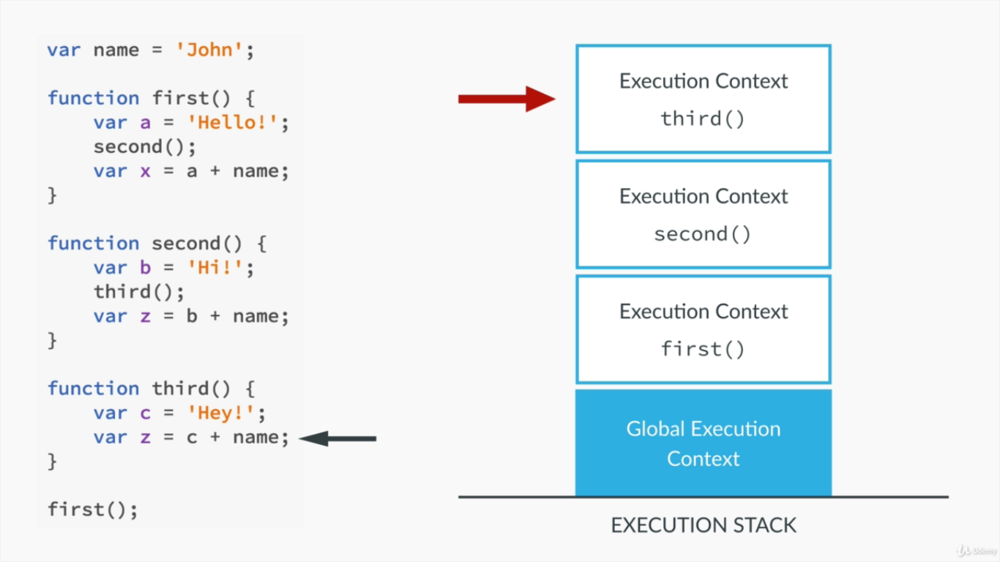

# JS

Different data types in JS
1. **Number:** including floating point numbers
2. **Boolean**
3. **String**
4. **Undefined:** does not have any value
5. **Null:** does not exist.
6. **Array and objects**.

**Dynamic typing in js**: Assigning data types automatically based on the value provided to the variables.

**JS** generally use camelcase notation to declare the variables.

Reserved JS keywords can not be used for variable names.

In JS variable names can start with
1. Alphabet.
2. Dollar
3. Underscore

There are three different types of variable declarations in JS
**const**: is to the nearest block it is defined.
**let**: scope is to the nearest block it is defined.
**var**: scope is in the nearest function it is defined.
**not with var**: declaring in global scope.

**const** has to be initialized and can not be updated. **let** can either be initialized or not and can be updated.

**Type coercion:** JS automatically converts the variable types to another while needed

```JS
console.log(var1 + ‘ ‘ + var2); // var1 is numb and var 2 is string.
```
**JS** adds the numbers till it encounters a string, once it encounters a string, it converts all the previous numb to a string.

**JS** variables can be mutated, i.e updated once they are defined.

There is precedence to every operator in JS. The precendence table can be found [here](https://developer.mozilla.org/en-US/docs/Web/JavaScript/Reference/Operators/Operator_Precedence#Table)

**==** is called loose equality checker, while **===** is called strict equality checker.

**==** checks if the value is equal (simply does type coercion)
**===** checks if the value and type of the varaibles are also equal.

**Truthy and falsy vlaues:**

Values that are converted to **True** when evaluated are **Truthy** values.
Values that are converted to **False** when evaluated are **Falsy** values.

**Falsy:** undefined, null, '', NAN, 0
**Truthy:** Not a falsy values.

**Functional statments:**
```js
function sum(a, b) {return a + b;}
```

**Functional expressions:**
```js
var sum = function(a,b) {return a+b;}
```

In both the above cases, calling functions, passing arguments etc are all same.

**Expressions**:
Anything that produces an output on evaluation is called **Expressions**.
There are different types of expressions
**Eg:**
1. Arithmetic
2. string 
3. logical
etc.

**statements**
Anything that executes some operations is called **statements**, **Eg:** statement declarations, conditional statements, loops, switch etc.

**Expression statements:**
when **js** expects a statement and an expression is used, then they are referred as expression statements.
In case of defining or modifying variable (```var b = 9 + 10```). The output of the expression is being assigned to a statement. This is a side affect of the expressions. This is called **Expression statements**. ```sum;``` is another example where it returns the value of sum and also being treated as a statement.

refer: https://medium.com/launch-school/javascript-expressions-and-statements-4d32ac9c0e74

---

Objects can be defined in two different formats:
1. using ```{}``` : called as Object literals.
2. Using ``` new Object()```: Normal Object syntax.

**Functions** attached to the Objects are called **methods**. Each object has a **this** keyword assosiated with it.

On assigning, a function expression to another variable, just write the name of the function without ```()```

Eg:
```js
var sums = function(a, b) {return a + b}
let a = {
    one: 1,
    two: 2
    add: sums
    };
a.add(a.one, a.two);
```

As most old browsers can not work with ES6, ES7, so on. The applications written with that syntax is converted back to the old languages, this is called **transpiling** or **polyfilling**

ECMA script is the organization that is monitoring JS now.

## Execution
Every browser has a virtual environment that compiles JS. There will be some JS engines to compile java-script.
1. Google V8 engine
2. spider monkey
3. js core

Initially, the code is parsed by the parser and checks the syntax and then it generates a Abstract syntax tree.

The code is then translated to machine code. Now the code is executed by the processor.

**Execution context** holds information about the environment in which the **JS** code is being executed.

The default execution context is **Global Execution Context**. This is the place where all the globally defined functions and variables are stored. This can be treated as an object where all the variables and functions are accessed in the form of properties to the object.

By default, these can be accessed via ```window``` object.
For example, when a variable named ```name``` is declared in a file. It can be accessed in two ways 
1. ```name```
2. ```window.name```

Whenever a function is called, a new execution context is created and all the code inside the function will be execution in that respective execution contexts.

All the **Execution contexts** are stored in form of **Execution stack** as shown below:

Each **Execution context** object has two different phases:
1. creation
2. execution

In the phase of **creating**, there are three different process done:
1. creating Variable Objects
2. Scope chain
3. "this" variable

**variable objects:**
1. argument object is created containing all the arguments passed to the function.
2. The entire code is scanned and all the avialable function declarations are given a variable object.
3. For each variable declared, the variable object is created and assigned to **undefined**

The steps (2 & 3) are called **hoisting**.

**functions (declarations not expressions)** are referred before the execution starts, while the **variables** are referred only during the execution.

**functions** and **variables** are hoisted in JS. It means that they are defnied before the execution phase start.

If you call a function before it's definition, it is called, but if you call a variable before it's declaration, it is printed as undefined. If the variable is not declared and if it is accessed then, it raises an error.

Each execution context has it's own variable objects declared.


**Scoping**:


