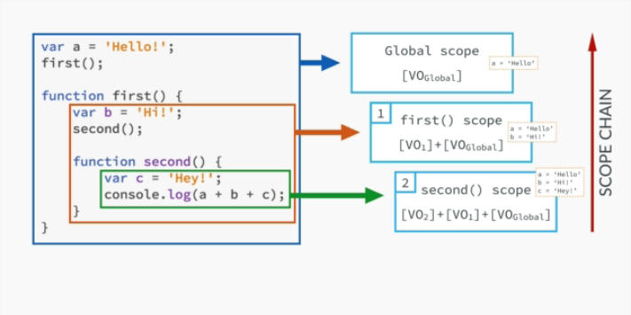
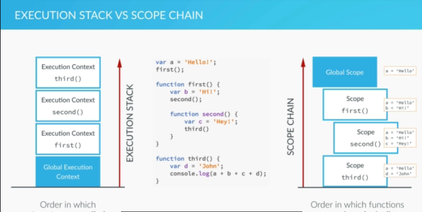
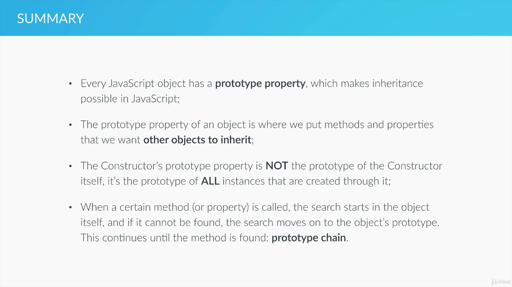

# JS

Different data types in JS

1. **Number:** including floating point numbers
2. **Boolean**
3. **String**
4. **Undefined:** does not have any value
5. **Null:** does not exist.
6. **Array and objects**.

**Dynamic typing in js**: Assigning data types automatically based on the value provided to the variables.

**JS** generally use camelcase notation to declare the variables.

Reserved JS keywords can not be used for variable names.

In JS variable names can start with

1. Alphabet.
2. Dollar
3. Underscore

There are three different types of variable declarations in JS

**const**: scope is to the nearest block it is defined.

**let**: scope is to the nearest block it is defined.

**var**: scope is in the nearest function it is defined.

**not with var**: declaring in global scope.

**const** has to be initialized and can not be updated. **let** can either be initialized or not and can be updated.

**Type coercion:** JS automatically converts the variable types to another while needed

Eg:

```JS
console.log(var1 + ‘ ‘ + var2); // var1 is numb and var 2 is string.
```

**JS** adds the numbers till it encounters a string, once it encounters a string, it converts all the previous numb to a string. This is called type coercion.

**JS** variables can be mutated, i.e updated once they are defined.

There is precedence to every operator in JS. The precendence table can be found [here](https://developer.mozilla.org/en-US/docs/Web/JavaScript/Reference/Operators/Operator_Precedence#Table)

**==** is called loose equality checker, while **===** is called strict equality checker.

**==** checks if the value is equal (simply does type coercion)
**===** checks if the value and type of the varaibles are also equal.

**Truthy and falsy vlaues:**

Values that are converted to **True** when evaluated are **Truthy** values.
Values that are converted to **False** when evaluated are **Falsy** values.

**Falsy:** undefined, null, '', NAN, 0

**Truthy:** Not a falsy values.

**Functional statments:**

```js
function sum(a, b) {
  return a + b;
}
```

**Functional expressions:**

```js
var sum = function(a, b) {
  return a + b;
};
```

In both the above cases, calling functions, passing arguments etc are all same.

**Expressions**:
Anything that produces an output on evaluation is called **Expressions**.
There are different types of expressions
**Eg:**

1. Arithmetic
2. string
3. logical
   etc.

**statements**:
Anything that executes some operations is called **statements**, **Eg:** statement declarations, conditional statements, loops, switch etc.

**Expression statements:**
when **js** expects a statement and an expression is used, then they are referred as expression statements.
In case of defining or modifying variable (`var b = 9 + 10`). The output of the expression is being assigned to a statement. This is a side affect of the expressions. This is called **Expression statements**. `sum;` is another example where it returns the value of sum and also being treated as a statement.

refer: https://medium.com/launch-school/javascript-expressions-and-statements-4d32ac9c0e74

---

Objects can be defined in two different formats:

1. using `{}` : called as Object literals.
2. Using `new Object()`: Normal Object syntax.

**Functions** attached to the Objects are called **methods**. Each object has a **this** keyword assosiated with it.

On assigning, a function expression to another variable, just write the name of the function without `()`

Eg:

```js
var sums = function(a, b) {return a + b}
let a = {
    one: 1,
    two: 2
    add: sums
    };
a.add(a.one, a.two);
```

As most old browsers can not work with ES6, ES7, so on. The applications written with that syntax is converted back to the old languages, this is called **transpiling** or **polyfilling**

ECMA script is the organization that is monitoring JS now.

## JS working:

## Execution

Every browser has a virtual environment (called javascript engines) that compiles JS. There are three main JS engines to compile java-script.

1. Google V8 engine
2. spider monkey
3. js core

Initially, the code is parsed by the parser and checks the syntax and then it generates a Abstract syntax tree.

The code is then translated to machine code. Now the code is executed by the processor.

**Execution context** holds information about the environment in which the **JS** code is being executed.

The default execution context is **Global Execution Context**. This is the place where all the globally defined functions and variables are stored. This can be treated as an object where all the variables and functions are accessed in the form of properties to the object.

By default, these can be accessed via `window` object.
For example, when a variable named `name` is declared in a file. It can be accessed in two ways

1. `name`
2. `window.name`

Whenever a function is called, a new execution context is created and all the code inside the function will be execution in that respective execution contexts.

All the **Execution contexts** are stored in form of **Execution stack** as shown below:

Once the execution of the function is completed, the **execution context** of the corresponding function also pops from the stack.

Each **Execution context** has the following

1. Variable Objects
2. Scope chain
3. "this" variable

Each **Execution context** object has two different phases:

1. creation: The above three properties are defined in this phase.
2. execution: The code is run line by line defining the variables.

**variable objects:**

1. argument object is created containing all the arguments passed to the function.
2. The entire code is scanned and all the available function declarations are given a variable object.
3. For each variable declared, the variable object is created and assigned to **undefined**

The steps (2 & 3) are called **hoisting**.

**functions** and **variables** are hoisted in JS. It means that they are defined before the execution phase start. But they are hoisted in different way.

**functions (statments not expressions)** are referred before the execution starts, while the **variables** are referred only during the execution.

**function expressions** and variables are treated in similarly in hoisting (i.e both of them are initialized to **undefined**)

If you call a function before it's definition, it works fine, but if you call a variable before it's declaration, it is printed as undefined. If the variable is not declared and if it is accessed then, it raises an error.

Each execution context has it's own variable objects declared.

**Scoping**:

Each function in JS creates a scope.

**Lexical scoping:** A function has the access to all the variables and functions declared in the parent scope.

If a JS engine does not find a variable in a current scope, it moves a step back to the parent scope and searches for it. If it does not find it in the parent scope even, then it still moves one step back. It moves back till it finds the variable of till the global scope is reached.

If it does not find any variables till the global scope, then it raises an error. The process of moving back for finding the variable is known as scope chaining.



The scope chain moves from current level to the top level, it can not move in the reverse direction i.e a variable declared in the child function can not be accessed by the parent.

**Execution Context stack** and **scope chain** are different. The first one depends on order in which functions are called, while the second one depends on the order in which the functions are declared.



**this keyword**:

Every execution context has a **this** keyword that points to itself. When you try to access the **this** keyword from a function, it prints the window object.

But in case of method, the this keyword points to the caller execution context. The **this** keyword is assigned when the object calls the particular function (inside the object).

## DOM

DOM is abbreviated as document object model. Every tag in HTML is treated as an object in the DOM.

The interaction of JS with the web pages can be done with DOM. There is a JS DOM API through which the elements in the HTML page can be manipulated. The DOM can also be accessed via many other languages.

`document.querySelector()` selects elements in similar manner to CSS. But it returns only the first occurrence of the element.

The selected element can be modified in two different ways:

1. `textContent` - Using this only the text can be added.
2. `innerHTML` - This can also be used to add HTML to DOM.

There can be many other ways of accessing it, apart of the above two methods.

`querySelector()` can be used for two purposes:

1. reading the content from HTML document.
2. Write the text or HTML content to the document.

`document.querySelector('.classname').style.style_name` is used to change the styles of the selected element in CSS.

`document.querySelectorAll()` is used in selecting all the elements instead of a single one.

`document.getElementByID()` returns a unique element with the given ID.

`document.getElementByClassName()` returns an array of elements with the given class name.

`document.getElementsByTagName()` returns all the elements with the specified tag name. It returns all of them in the form of a array. If `*` is passed as an argument, it returns all the elements in DOM.

## Events

Performing any operation in the web page comes under events. Every event can be handled using the event handlers. Every event listener has it's own execution context.

All the events in JS are put in a queue and executed one by one.

Before manipulating any element in JS, it has to be selected first using the methods specified in above section. Once they are selected, any operations can be performed with them.

In this section, we attach event listeners to them in-order to listen to particular events.

The event handlers can be attached in the following format:

```js
document
  .querySelector(".class_name")
  .addEventListener("event_name", function() {
    // function to handle the events,this is a callback function.
  });
```

**Note:** Event handlers are executed only when the execution context stack is empty (i.e execution context stack has only the global object in it). If there are any other objects in it, all the objects are executed and then the event handler is called.

You can find the list of available events here: https://developer.mozilla.org/en-US/docs/Web/Events

## Appending and removing elements

```js
document.querySelector("elem").classList; //returns list of all classes in the element.
```

There can be few methods through which the above classList can be manipulated, they are like

1. add: adds the class
2. remove: removes the class.
3. toggle: toggles between remove and add, etc.

## Object oriented programming through JS

In JS a common function can be used as a blue print, instead of defining objects all the times. It is known as constructors. For examlple:

```js
var john = {
  name: "John",
  age: 21,
  email: "john@gmail.com"
};

var marie = {
  name: "Marie",
  age: 24,
  email: "marie@gmail.com"
};

/*
 Instead of defining both of them individually, a common function can be used for defining it and instances of that function can be created.
*/

var Person = function(name, age, email) {
  this.name = name;
  this.age = age;
  this.email = email;
};

var john1 = new Person("John", 21, "john@gmail.com");
var marie1 = new Person("Marie", 24, "marie@gmail.com");
```

In the above example `Person` is a common function. All the other variables can create instances from it. Hence it is call a constructor. The `this` keyword is assigned to the corresponding variable (like **john1**, **marie1**) instead of global object because the `new` keyword creates an new object which is being assigned to the `john` and `marie` variables. The `this` keyword now points to the newly created object (i.e it generally points to the object which it belongs to) as it belongs to it.

In the above `Person` defination, each instance has it's own properties and methods allocated to it. If methods are created in the above function, each instance even will have it's own memory to each of the methods. This affects performance!!

To prevent it, we use prototypes. The prototypes are used in defining methods and properties. The methods and properties defined will be common to all the instances.

The `hasOwnProperty()` method can only check with the original properties of the object (i.e not with the prototpye ones).

Prototype can be used in following ways:



Each object that we create, defaulty inherits the Object class. Each class can a set of protoype properties and methods defined.

If a method is called from a instance of a function and it initially searches in it's list of methods.

If found, okay else it searches in the prototype methods.

If it can not find in the prototype methods, then, it searches in the parent class prototype methods. If it reaches to the base one i.e Object class and if it could not find the method even in the Object class, then it may raise an error.

The above process is called prototype chaining.

The Objects can be created in two main different ways:

1. function constructors.
2. Object.create method

Object creation using Object.create method:

```js
var personProto = {
  calc: function() {
    return 2019 - this.yearOfBirth;
  }
};

var john = Object.create(personProto, {
  name: { value: "John" },
  yearOfBirth: { value: 1999 },
  email: { value: "john@gmail.com" }
});
/* 

The above code creates the an object with parameters name, 
email and yearOfBirth.

All the functions inside PersonProto will be assigned as prototype functions.


This is the main difference between Object.create and function constructors.
*/
```
